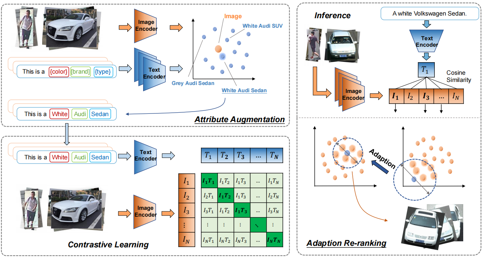

<p>
	<a href="./README-ch.md">[CN-version]</a>
</p>

# Cross-Modal Large Model Image Retrieval Competition


High-performance image retrieval capabilities in traffic scenes are crucial for traffic law enforcement and security management. Traditional image retrieval methods typically use attribute recognition on images and then compare them with the desired attributes to achieve retrieval. With the development of multimodal large model technology, the unification of text and image representation and modal transformation has been widely applied. Utilizing this capability can further improve the accuracy and flexibility of image retrieval.

🎉🎉🎉 We got the Top-10 Award in the [CVPR 2023 Large Model Multimodal Retrieval Challenge ](https://foundation-model.com/).

🎉🎉🎉 Our work [Self-Enhancement Improves Text-Image Retrieval in Foundation Visual-Language Models](https://arxiv.org/abs/2306.06691) reltaed to this competition is also published in the CVPR 2023, feel free to cite us [here](#Citations).

# 1 Introduction
The [CVPR 2023 Large Model Multimodal Retrieval Challenge ](https://foundation-model.com/)aims to improve the accuracy of text-image retrieval in traffic scenes. We annotated the text descriptions of multiple public datasets and images of traffic participants from the web to construct many-to-many image-text pairs. Participants can conduct multimodal research based on this dataset to enhance the accuracy of text retrieval from images.

# 2 Reproduce
Tip: Due to changes in the execution logic of the Infer code during post-competition data organization, there may be minor differences in the reproduction results.

## 2.1 Tournament Review
1. Reproducible Pytorch algorithm code: ```notebook-reproduce.ipynb``` provides a one-click run Jupyter Notebook for reproduction, ```notebook-quick-review.ipynb``` provides a Jupyter Notebook for quickly obtaining optimal result files, and  ```notebook-quick-review-last.ipynb``` provides a Jupyter Notebook for obtaining the result file of the last submission quickly.
2. Submit the corresponding checkpoint file of the model: The logs are saved in ```best-result-review``` , and the model needs to be downloaded separately.
Download link: https://pan.baidu.com/s/17P6nzWl9PnVH42DFQsCd_w Extraction code: 067e
3. Explanation of the code content: Detailed explanations are provided in  ```notebook-reproduce.ipynb``` and ```notebook-reproduce.ipynb``` 

4. Model construction idea

   （1） Complete algorithm structure diagram, detailed idea steps, and code organization introduction: See the following introduction

   （2）Data augmentation/cleaning strategy: See the following introduction

   （3）Parameter optimization strategy (if multiple iterations, specific iteration strategies should also be explained): See the following introduction

   （4）Training script/code, preferably including the running log of one epoch: Provided in the "Reproducible Pytorch algorithm code, ```notebook-reproduce.ipynb```. ```best-result-review``` provides the running log of the best A-board training result.

   （5）Test script/code, must include the running log to obtain the final accuracy: Provided in the "Reproducible Pytorch algorithm code,  ```notebook-quick-review*.ipynb```, where ```notebook-quick-review``` represents the optimal submission result, and ```notebook-quick-review-last``` represents the last submission result.

## 2.2 Pre-download Content
1. Model checkpoint file:  https://pan.baidu.com/s/17P6nzWl9PnVH42DFQsCd_w Extraction code: 067e
2. Dataset file: https://pan.baidu.com/s/1RXR7q_LAxRusSlamfmoG9A Extraction code: tjz2 
3. Data augmentation file: https://pan.baidu.com/s/1EFiY6dt5v0Na1SgGZByHvw Extraction code: 922a

## 2.3 Code Structure
The tree below illustrates the organization of this project.
```bash
├── data
│   ├── augmented*.txt #Data augmentation file
│   ├── car_attrbute*.json #Car attribute file
│   ├── dataset #Dataset (ImageRetrival, need to be downloaded from Baidu Pan)
├── best-result-review #Consistent with log, but this folder separately saves the running records of the best submission
│   │   ├──out.log
│   │   ├──params.txt
│   │   ├──checkpoints #Need to be downloaded separately
│   │   ├──tensorboard
├── log
│   ├── * #Log folder (each training will generate a unique folder)
│   │   ├──out.log #Output training log
│   │   ├──params.txt #Hyperparameters
│   │   ├──checkpoints #Model weights
│   │   ├──tensorboard #Run tensorboard --logdir=./tensorboard --host localhost --port 20421 in the * directory to open the tensorboard of the current training at localhost:20421
├── script #Run script, it is recommended to check notebook-reproduce.ipynb
├── src 
│   ├── infer
│   │   ├──merge_json.py
│   │   ├──open_clip_infer.py #Inference code
│   │   ├──open_clip_infer_prompt.py #Inference code + Prompt enhancement
│   ├── preprocess
│   │   ├──parse_attr.py #Get car attribute file
│   │   ├──parse_augment.py #Parse the format of augmented data into the format required by CLIP training
│   │   ├──parse_split.py #Parse the format of *_person_label.txt and *_car_label.txt (separated data in data/datasets/*_label.txt) into the format required by CLIP training
│   ├── train
│   │   ├──* #Refer to https://github.com/mlfoundations/open_clip
│   │   ├──data #Stores the csv files used by open_clip for inference
│   │   ├──training
│   │   │   ├──*
│   │   │   ├──params.py #Explanation of various parameters in script/run_model.sh
│   │   │   ├──main.py #Main file to run model training
```

# 3 Framework and Pipeline
This competition mainly utilizes the CLIP method for multimodal contrastive learning training. The overall training idea is as follows:
<!-- <p align="center">

<br><br>
<b>图1.Main Framework</b>
</p> -->



## 3.1 Optimization Strategy
The following descriptions are strategies that can improve the score on the A leaderboard.

### 3.1.1 Model Selection
Large models contain a large amount of implicit knowledge, and the network pathways of the model also have stronger robustness. In this project, it was found that large models have good robustness for light conditions and good white balance capabilities.
ViT-G-14 large model is selected as the backbone network.

### 3.1.2 Balancing Image Sample Sizes
Considering the large difference in the size ratio between car and person images, we padded both car and person images to a square shape (filled with 0) and then resized them to 224.


### 3.1.3  Zero-Shot Data Augmentation
**(a) Analysis**

Use ViT-G-14 for zero-shot data augmentation of car samples, focusing on three aspects: color, brand, and car type.
- Color: ViT-G-14 has strong robustness in color recognition, so data augmentation can be performed.
- Car type: The contrastive learning version of ViT-G-14 is trained on internet data, and the internet is rich in data on car types, so data augmentation can be performed.
- Brand: It was found that large models perform poorly on fine-grained classification like brands, so data augmentation is not performed.

**(b) Prompt Construction**

The prompt construction requirements are as follows:
- For missing types, the prompt is constructed as: "{prefix} + color + brand + {Prompt-Type}"
- For missing color and brand, there is no need to go zero-shot for the brand, so the prompt is constructed as: "{prefix} + {Prompt-Color} + Type"

Here, {prefix} refers to the original self-contained prefix in the attribute text label.

### 3.1.4 Large Data Distribution Differences
1. There is a significant difference between the vehicle image distributions of the training set and the test set, resulting in an insignificant improvement in accuracy on the test set. Use a small learning rate of $4e-7$ and only fine-tune for 5 epochs.
2. The training set is a web dataset, and the test set is a surveillance dataset. Essentially, it is a cross-domain problem. During Query, a Prompt enhancement was done, i.e., adding "image taken by traffic surveillance cameras" to the car data.

<a id="Citations"></a>
# 4 Citations
please cite our work with the following:
```bash
Yang Y, Wang Y, Geng S, et al. Self-Enhancement Improves Text-Image Retrieval in Foundation Visual-Language Models[J]. Proceedings of the IEEE/CVF Conference on Computer Vision and Pattern Recognition. 2023.

@inproceedings{yang2023self,
  title={Self-Enhancement Improves Text-Image Retrieval in Foundation Visual-Language Models},
  author={Yang, Yuguang and Wang, Yiming and Geng, Shupeng and Wang, Runqi and Wang, Yimi and Wu, Sheng and Zhang, Baochang},
  booktitle={Proceedings of the IEEE/CVF Conference on Computer Vision and Pattern Recognition},
  year={2023}
}
```

# 5 Acknowledgments
Thanks to Ilharco, Gabriel, and others for providing the CLIP contrastive learning training code [OpenCLIP](https://github.com/mlfoundations/open_clip)
